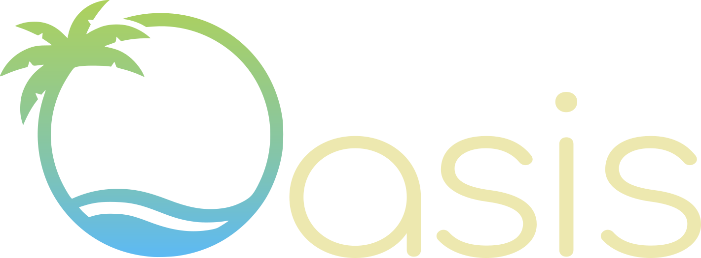
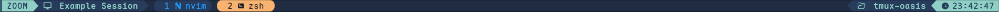

<p align="center">
  
</p>
<hr/>
<p align="center">
  <a href="https://github.com/uhs-robert/tmux-oasis/stargazers"></a>
  <a href="https://github.com/uhs-robert/tmux-oasis/issues"></a>
  <a href="https://github.com/uhs-robert/tmux-oasis/contributors"></a>
  <a href="https://github.com/uhs-robert/tmux-oasis/network/members"></a>
</p>
<p align="center">
A collection of <strong>13</strong> desert-inspired Tmux colorscheme status lines; with <strong>dual light/dark modes</strong>.
</p>

## 🎨 Status Bar with Dynamic Modes

Wouldn't it be nice to know what mode you're in? And not just one mode, but for **ALL modes like in Vim**.

Oasis provides a fully styled status line with a robust dynamic mode indicator for **ALL** of tmux's modes and **13 unique color schemes**.

<div align="center">

**Normal Mode**
<br>


**Command Mode**
<br>


**Copy Mode**
<br>


**View Mode**
<br>


**Choose Mode**
<br>


**Zoom Mode**
<br>


**Options Mode**
<br>


**Clock Mode**
<br>


</div>

> [!NOTE]
> Previews above all use the `lagoon_dark` style.

## 🌅 Overview

Choose from 13 distinct desert-inspired base styles, each with its own personality and color palette. Dual-mode themes now ship with one dark plus five fine-grained light variants.

<details>
<summary>✨ What's New / 🚨 Breaking Changes</summary>
<br/>
<!-- whats-new:start -->

  <details>
    <summary>🚨 v2.0: Dual Style Themes / Deprecated Themes</summary>
    <!-- v4:start -->
    <h3>✨ Dual Style Themes</h3>
    Each style now has <strong>5 light theme variants</strong>.
    <ul>
      <li>Check out the <a href="#%EF%B8%8F-light-styles">new light theme screenshots</a>.</li>
    </ul>
    <h3>🚨 BREAKING CHANGE: Deprecated Light Theme Migration</h3>
    The following standalone <strong>light themes have been deprecated</strong> in favor of the dual-mode system:
    <table>
      <tr>
        <td>Dawn</td>
        <td>Replaced with <code>night_light_1</code></td>
      </tr>
      <tr>
        <td>Dawnlight</td>
        <td>Replaced with <code>night_light_2</code></td>
      </tr>
      <tr>
        <td>Day</td>
        <td>Replaced with <code>night_light_3</code></td>
      </tr>
      <tr>
        <td>Dusk</td>
        <td>Replaced with <code>night_light_4</code></td>
      </tr>
      <tr>
        <td>Dust</td>
        <td>Replaced with <code>night_light_5</code></td>
      </tr>
    </table>
    <blockquote>
    <strong>Note:</strong> The migration table above shows direct replacements. All deprecated themes were based on the <code>night</code> style family.
    </blockquote>
    <br/>
    <!-- v4:end -->
  </details>
<!-- whats-new:end -->
</details>

## 🌙 Dark Styles

Click any card below to view the full preview and syntax sample. [↓ Or click here to view all full previews](#view-all-theme-styles)

### Dark Previews

<table>
  <tr>
    <td align="center">
      <a href="#night-dark"></a><br>
      <strong>Night</strong><br><em>Night Sky</em>
    </td>
    <td align="center">
      <a href="#midnight-dark"></a><br>
      <strong>Midnight</strong><br><em>Off Black</em>
    </td>
    <td align="center">
      <a href="#abyss-dark"></a><br>
      <strong>Abyss</strong><br><em>Black</em>
    </td>
    <td align="center">
      <a href="#starlight-dark"></a><br>
      <strong>Starlight</strong><br><em>Black Vivid</em>
    </td>
  </tr>
  <tr>
    <td align="center">
      <a href="#desert-dark"></a><br>
      <strong>Desert</strong><br><em>Grey</em>
    </td>
    <td align="center">
      <a href="#sol-dark"></a><br>
      <strong>Sol</strong><br><em>Red</em>
    </td>
    <td align="center">
      <a href="#canyon-dark"></a><br>
      <strong>Canyon</strong><br><em>Orange</em>
    </td>
    <td align="center">
      <a href="#dune-dark"></a><br>
      <strong>Dune</strong><br><em>Yellow</em>
    </td>
  </tr>
  <tr>
    <td align="center">
      <a href="#cactus-dark"></a><br>
      <strong>Cactus</strong><br><em>Green</em>
    </td>
    <td align="center">
      <a href="#mirage-dark"></a><br>
      <strong>Mirage</strong><br><em>Teal</em>
    </td>
    <td align="center">
      <a href="#lagoon-dark"></a><br>
      <strong>Lagoon (Default)</strong><br><em>Blue</em>
    </td>
    <td align="center">
      <a href="#twilight-dark"></a><br>
      <strong>Twilight</strong><br><em>Purple</em>
    </td>
  </tr>
  <tr>
    <td align="center">
      <a href="#rose-dark"></a><br>
      <strong>Rose</strong><br><em>Pink</em>
    </td>
  </tr>
</table>

## ☀️ Light Styles

### Light Previews

The examples below use the light style 3.

<table>
  <tr>
    <td align="center"><a href="#night-light"></a><br><strong>Night · Light</strong></td>
    <td align="center"><a href="#midnight-light"></a><br><strong>Midnight · Light</strong></td>
    <td align="center"><a href="#abyss-light"></a><br><strong>Abyss · Light</strong></td>
    <td align="center"><a href="#starlight-light"></a><br><strong>Starlight · Light</strong></td>
  </tr>
  <tr>
    <td align="center"><a href="#desert-light"></a><br><strong>Desert · Light</strong></td>
    <td align="center"><a href="#sol-light"></a><br><strong>Sol · Light</strong></td>
    <td align="center"><a href="#canyon-light"></a><br><strong>Canyon · Light</strong></td>
    <td align="center"><a href="#dune-light"></a><br><strong>Dune · Light</strong></td>
  </tr>
  <tr>
    <td align="center"><a href="#cactus-light"></a><br><strong>Cactus · Light</strong></td>
    <td align="center"><a href="#mirage-light"></a><br><strong>Mirage · Light</strong></td>
    <td align="center"><a href="#lagoon-light"></a><br><strong>Lagoon · Light</strong></td>
    <td align="center"><a href="#twilight-light"></a><br><strong>Twilight · Light</strong></td>
  </tr>
  <tr>
    <td align="center"><a href="#rose-light"></a><br><strong>Rose · Light</strong></td>
  </tr>
</table>

## ✨ Features

- **Advanced status line** with dynamic mode indicators based on `vim` for each of tmux's modes.
  - Includes: `NORMAL`, `COMMAND`, `COPY`, `VIEW`, `CHOOSE`, `CLOCK`, `OPTIONS`, and `ZOOM` modes.
  - **Customizable mode formats**: Set `@oasis_mode_format` to `short` (single letter), `full` (complete word), `icon` (Nerd Font icons), or `custom` (user-defined labels)
- **13 base styles** with granular variants: dual-mode themes provide 1 dark + 5 light levels
- **Automatic theme loading**, set `@oasis_flavor` and the system will handle the rest (suffixes added for you)
- **Modular design** with separate theme and status line module configurations (_download **only** what you need_)
- **Standalone** with zero dependencies on any other plugins

## 📦 Installation

For customization options, please see [all configuration options](#config-options).

### Method 1: Tmux Plugin Manager (TPM) - Recommended

1. Add to your `tmux.conf`:

```tmux
set -g @plugin 'uhs-robert/tmux-oasis'
set -g @oasis_flavor "lagoon_dark"  # Optional: defaults to lagoon_dark
```

2. Install with TPM: `prefix + I`

### Method 2: Manual Installation

1. Clone this repository:

```bash
git clone https://github.com/uhs-robert/tmux-oasis ~/.tmux/themes/oasis
```

2. In your `tmux.conf`, set your preferred theme style:

```tmux
set -g @oasis_flavor "lagoon_dark"
```

3. Source the main configuration:

```tmux
source-file "~/.tmux/themes/oasis/oasis_tmux.conf"
```

4. Reload tmux: `tmux source ~/.tmux.conf`

## ⚙️ Configuration

Oasis offers _many_ different styles to choose from. First, pick a theme!

- **Dual-mode themes**: `abyss`, `cactus`, `canyon`, `desert`, `dune`, `lagoon`, `mirage`, `midnight`, `night`, `rose`, `sol`, `starlight`, `twilight`
  - Variants: `_dark` and `_light_1` … `_light_5`
  - Short names auto-expand to dark: setting `set -g @oasis_flavor "lagoon"` loads `lagoon_dark`

Examples:

```tmux
set -g @oasis_flavor "canyon_light_3"   # For light variant 3
set -g @oasis_flavor "night"            # Resolves to night_dark
```

Then set up any additional configuration options for more customization!

<a id="config-options"></a>

<details>
  <summary>🍦 Configuration Options & Defaults</summary>
  <br>
<!-- config:start -->

All options below show their default values. Add any of these to your `tmux.conf` to override:

```tmux
# Theme variant (13 base styles × 6 variants each = 78 total themes)
# Options: [style]_dark, [style]_light_1, [style]_light_2, [style]_light_3, [style]_light_4, [style]_light_5
# Styles: abyss, cactus, canyon, desert, dune, lagoon, mirage, midnight, night, rose, sol, starlight, twilight
set -g @oasis_flavor "lagoon_dark"

# Mode indicator display format
# Options: "short" (N, C, V), "full" (NORMAL, COPY, VIEW), "icon" (Nerd Font icons), "custom" (see below)
set -g @oasis_mode_format "full"

# Custom mode labels (only used when @oasis_mode_format is "custom")
set -g @oasis_mode_custom_normal "NORMAL"
set -g @oasis_mode_custom_command "COMMAND"
set -g @oasis_mode_custom_copy "COPY"
set -g @oasis_mode_custom_view "VIEW"
set -g @oasis_mode_custom_choose "CHOOSE"
set -g @oasis_mode_custom_options "OPTIONS"
set -g @oasis_mode_custom_clock "CLOCK"
set -g @oasis_mode_custom_zoom "ZOOM"

# Clock module settings
set -g @oasis_clock_24h "on"      # "on" for 24-hour format, "off" for 12-hour AM/PM
set -g @oasis_clock_icon "󰥔 "     # Icon/text shown before time

# Folder/directory module settings
set -g @oasis_folder_icon " "    # Icon/text shown before directory path

# Session module settings
set -g @oasis_session_icon "󰍹 "  # Icon/text shown before session name
```

<!-- config:end -->
</details>

## ⚙️ (Devs) Creating New Theme Styles

1. Dark variant: Create `themes/dark/oasis_<name>_dark.conf`
2. Light variants: Create `themes/light/[1-5]/oasis_<name>_light_[1-5].conf` (5 brightness levels)
3. Define all the `@thm_*` color variables in each variant file
4. Set `@oasis_flavor` to your new variant to test it

> [!TIP]
> Dual-mode themes should ship with one `_dark` and five `_light_[1-5]` files for consistent UX.

## 👀 View All Theme Styles

> All screenshots below show how the theme looks [with the companion theme in neovim](https://github.com/uhs-robert/oasis.nvim)

> [!IMPORTANT]
> The status line at the top is the TMUX plugin integration.

<a id="view-all-theme-styles"></a>

<details open>
  <summary><b>All styles (click to collapse)</b></summary>
  <!-- all-styles:start -->

### Dark previews

<a id="night-dark"></a>
**Night (Dark · Night Sky)**


<p align="center">
  <a href="#dark-previews">↑ Back to Dark Styles</a>
</p>

<a id="midnight-dark"></a>
**Midnight (Dark · Off Black)**


<p align="center">
  <a href="#dark-previews">↑ Back to Dark Styles</a>
</p>

<a id="abyss-dark"></a>
**Abyss (Dark · Black)**


<p align="center">
  <a href="#dark-previews">↑ Back to Dark Styles</a>
</p>

<a id="starlight-dark"></a>
**Starlight (Dark · Black Vivid)**


<p align="center">
  <a href="#dark-previews">↑ Back to Dark Styles</a>
</p>

<a id="desert-dark"></a>
**Desert (Dark · Grey)**


<p align="center">
  <a href="#dark-previews">↑ Back to Dark Styles</a>
</p>

<a id="sol-dark"></a>
**Sol (Dark · Red)**


<p align="center">
  <a href="#dark-previews">↑ Back to Dark Styles</a>
</p>

<a id="canyon-dark"></a>
**Canyon (Dark · Orange)**


<p align="center">
  <a href="#dark-previews">↑ Back to Dark Styles</a>
</p>

<a id="dune-dark"></a>
**Dune (Dark · Yellow)**


<p align="center">
  <a href="#dark-previews">↑ Back to Dark Styles</a>
</p>

<a id="cactus-dark"></a>
**Cactus (Dark · Green)**


<p align="center">
  <a href="#dark-previews">↑ Back to Dark Styles</a>
</p>

<a id="mirage-dark"></a>
**Mirage (Dark · Teal)**


<p align="center">
  <a href="#dark-previews">↑ Back to Dark Styles</a>
</p>

<a id="lagoon-dark"></a>
**Lagoon (Dark · Default)**


<p align="center">
  <a href="#dark-previews">↑ Back to Dark Styles</a>
</p>

<a id="twilight-dark"></a>
**Twilight (Dark · Purple)**


<p align="center">
  <a href="#dark-previews">↑ Back to Dark Styles</a>
</p>

<a id="rose-dark"></a>
**Rose (Dark · Pink)**


<p align="center">
  <a href="#dark-previews">↑ Back to Dark Styles</a>
</p>

### Light previews

<a id="night-light"></a>
**Night (Light)**


<p align="center">
  <a href="#light-previews">↑ Back to Light Styles</a>
</p>

<a id="midnight-light"></a>
**Midnight (Light)**


<p align="center">
  <a href="#light-previews">↑ Back to Light Styles</a>
</p>

<a id="abyss-light"></a>
**Abyss (Light)**


<p align="center">
  <a href="#light-previews">↑ Back to Light Styles</a>
</p>

<a id="starlight-light"></a>
**Starlight (Light)**


<p align="center">
  <a href="#light-previews">↑ Back to Light Styles</a>
</p>

<a id="desert-light"></a>
**Desert (Light)**


<p align="center">
  <a href="#light-previews">↑ Back to Light Styles</a>
</p>

<a id="sol-light"></a>
**Sol (Light)**


<p align="center">
  <a href="#light-previews">↑ Back to Light Styles</a>
</p>

<a id="canyon-light"></a>
**Canyon (Light)**


<p align="center">
  <a href="#light-previews">↑ Back to Light Styles</a>
</p>

<a id="dune-light"></a>
**Dune (Light)**


<p align="center">
  <a href="#light-previews">↑ Back to Light Styles</a>
</p>

<a id="cactus-light"></a>
**Cactus (Light)**


<p align="center">
  <a href="#light-previews">↑ Back to Light Styles</a>
</p>

<a id="mirage-light"></a>
**Mirage (Light)**


<p align="center">
  <a href="#light-previews">↑ Back to Light Styles</a>
</p>

<a id="lagoon-light"></a>
**Lagoon (Light)**


<p align="center">
  <a href="#light-previews">↑ Back to Light Styles</a>
</p>

<a id="twilight-light"></a>
**Twilight (Light)**


<p align="center">
  <a href="#light-previews">↑ Back to Light Styles</a>
</p>

<a id="rose-light"></a>
**Rose (Light)**


<p align="center">
  <a href="#light-previews">↑ Back to Light Styles</a>
</p>

  <!-- all-styles:end -->
</details>
