# 🏜️ Oasis Tmux

A modular desert-themed colorscheme for Tmux with warm, earthy tones and multiple palette variants. Originally inspired by the classic `desert` theme for vim; includes a status line inspired by vim as well.

> [!TIP]
> This is the companion to the **Oasis** theme suite from NeoVim: [oasis.nvim](https://github.com/uhs-robert/oasis.nvim)

## Features

- **Multiple theme variants**: Support for all the Oasis theme variants (`lagoon`, `desert`, `dune`, etc.)
- **Automatic theme loading**: Set `@oasis_flavor` and the system will handles the rest
- **Advanced status line**: Dynamic mode indicators with color-coded states inspired by `vim` for each of tmux's modes: includes `NORMAL`, `COMMAND`, `COPY`, `VIEW`, `CHOOSE`, `CLOCK`, and `OPTIONS` modes. See [status bar screenshots here](#status-bar-with-dynamic-modes)
- **Modular design**: Separate theme files and unique status line configurations
- **Standalone**: Zero dependencies on any other plugin

## Screenshots

### Classic Desert Themes

<table>
  <tr>
    <td>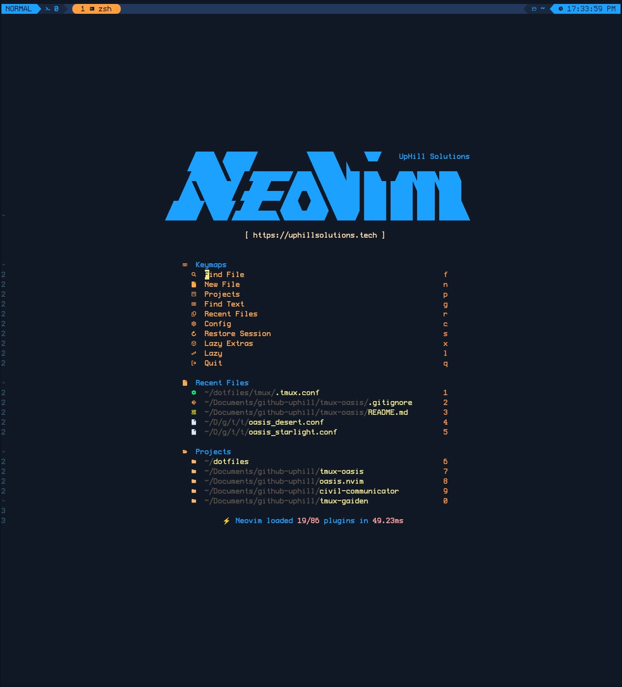</td>
    <td>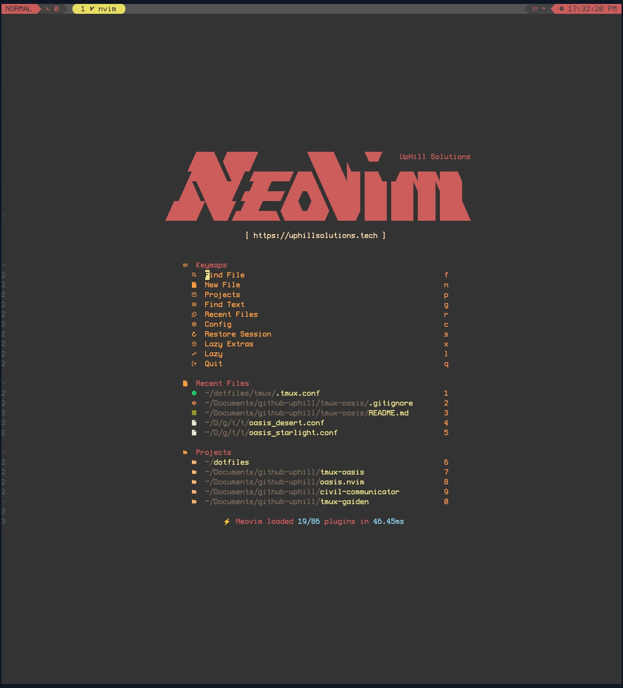</td>
  </tr>
  <tr>
    <td align="center">Lagoon</td>
    <td align="center">Desert</td>
  </tr>
  <tr>
    <td>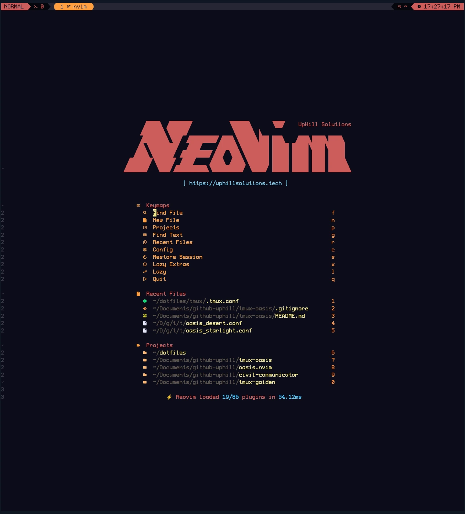</td>
    <td>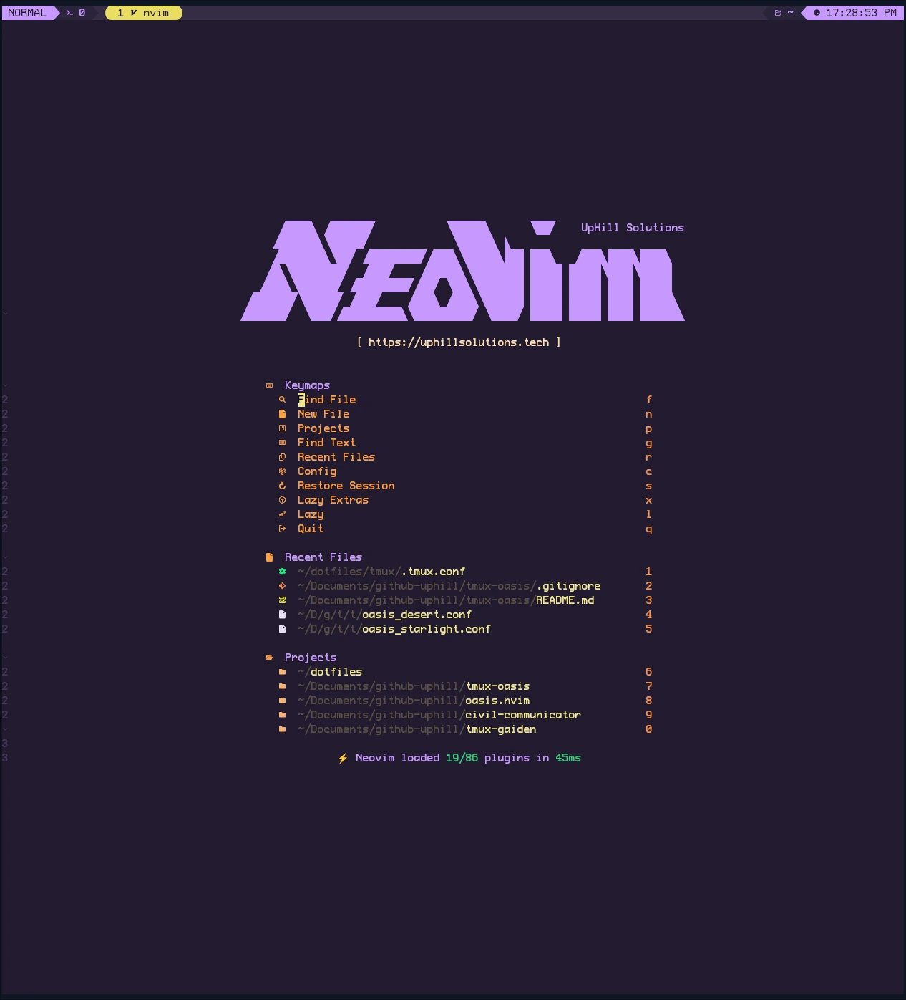</td>
  </tr>
  <tr>
    <td align="center">Abyss</td>
    <td align="center">Twilight</td>
  </tr>
</table>

### Full Color Spectrum (This is just a sample, [click here to see all 12](/assets/screenshots/))

<table>
  <tr>
    <td>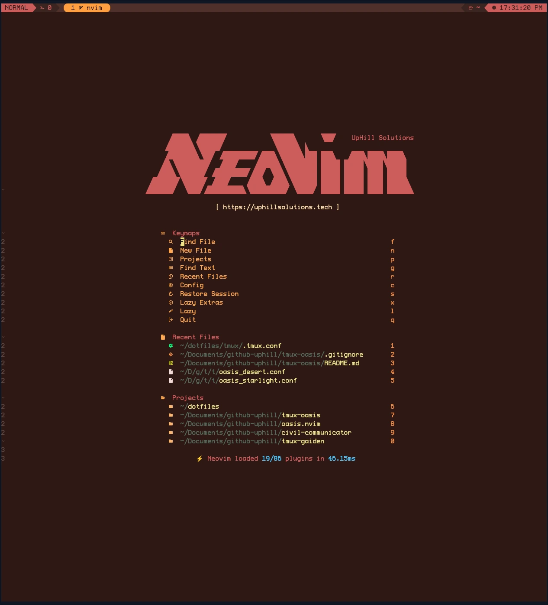</td>
    <td>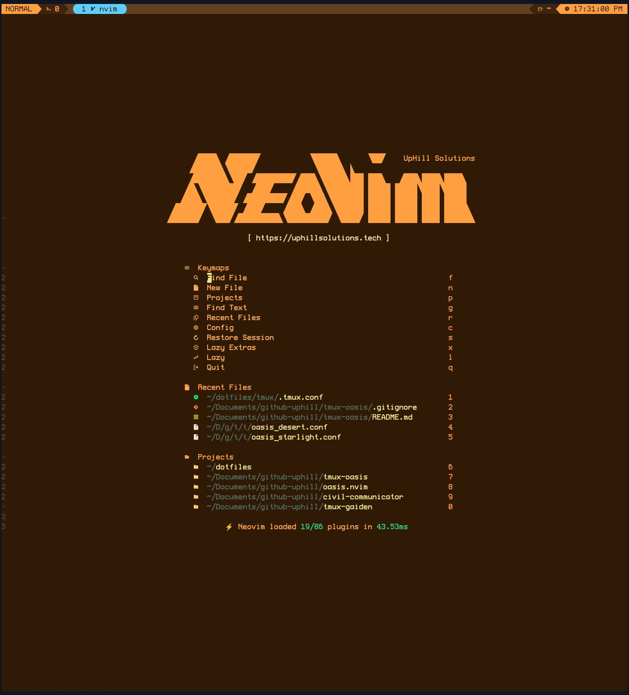</td>
  </tr>
  <tr>
    <td align="center">Sol</td>
    <td align="center">Canyon</td>
  </tr>
  <tr>
    <td></td>
    <td></td>
  </tr>
  <tr>
    <td align="center">Mirage</td>
    <td align="center">Cactus</td>
  </tr>
</table>

### Status Bar with Dynamic Modes

<div align="center">

**Normal Mode**
<br>
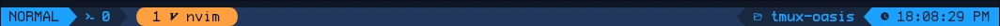

**Command Mode**
<br>


**Copy Mode**
<br>
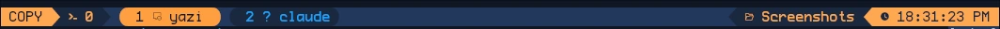

**View Mode**
<br>
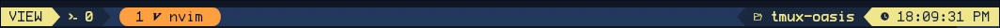

**Choose Mode**
<br>
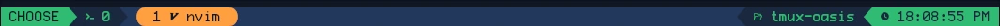

**Clock Mode**
<br>
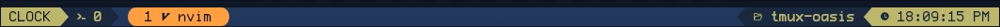

**Options Mode**
<br>
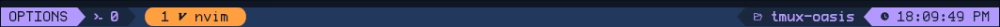

</div>

<details>
  <summary><b>All variants (click to expand)</b></summary>

### Abyss


### Cactus


### Canyon


### Desert


### Dune


### Lagoon


### Mirage


### Night


### Rose


### Sol


### Starlight


### Twilight


</details>

## Installation

### Method 1: Tmux Plugin Manager (TPM) - Recommended

1. Add to your `tmux.conf`:

```tmux
set -g @plugin 'uhs-robert/tmux-oasis'
set -g @oasis_flavor "lagoon"  # Optional: defaults to lagoon
```

2. Install with TPM: `prefix + I`

### Method 2: Manual Installation

1. Clone this repository:

```bash
git clone https://github.com/uhs-robert/tmux-oasis ~/.tmux/themes/tmux-oasis
```

2. In your `tmux.conf`, set your preferred theme variant:

```tmux
set -g @oasis_flavor "lagoon"
```

3. Source the main configuration:

```tmux
source-file "~/.tmux/themes/tmux-oasis/oasis_tmux.conf"
```

4. Reload tmux: `tmux source ~/.tmux.conf`

## Usage

### Available Theme Variants

#### Classic Desert Themes

- `lagoon` (default) - The original Oasis theme, the heart of the oasis is a lagoon
- `desert` - Classic desert theme inspired by vim with warm sand and earth tones
- `abyss` - Deep, dark variant with mysterious depths
- `twilight` - Evening desert with purple and indigo hues

#### Full Color Spectrum

- `sol` - Bright sunny yellows and warm light tones
- `canyon` - Rich reds and oranges of desert canyons
- `mirage` - Cool blues and teals of desert mirages
- `cactus` - Fresh greens of desert vegetation

#### Additional Variants

- `dune` - Sandy beiges and warm earth tones
- `night` - Dark blues and purples of desert nights
- `rose` - Soft pinks and warm rose tones
- `starlight` - Another black theme, with vibrant/vivid colors

Feel free to add your own variants by creating `themes/oasis_[variant].conf` files

### Theme Variables

Each theme provides these color variables:

- `@thm_fg` - Foreground text color
- `@thm_primary` - Primary accent color
- `@thm_secondary` - Secondary accent color
- `@thm_core` - Core/background color
- `@thm_mantle` - Mantle color
- `@thm_surface` - Surface color
- `@thm_red`, `@thm_orange`, `@thm_yellow`, `@thm_green`, etc. - Standard colors

### Creating New Theme Variants

1. Create a new file in `themes/oasis_[name].conf`
2. Define all the `@thm_*` color variables
3. Use `set -g @oasis_flavor "[name]"` in your tmux.conf

### Status Line Features

The status line is inspired from lualine in Neovim. It includes:

- **Dynamic mode indicators**: Visual indicators for copy mode, command mode, etc.
- **Session information**: Current session name with icons
- **Current directory**: Abbreviated path display
- **Real-time clock**: Hours, minutes, seconds with AM/PM
- **Color-coded states**: Different colors for different tmux modes
