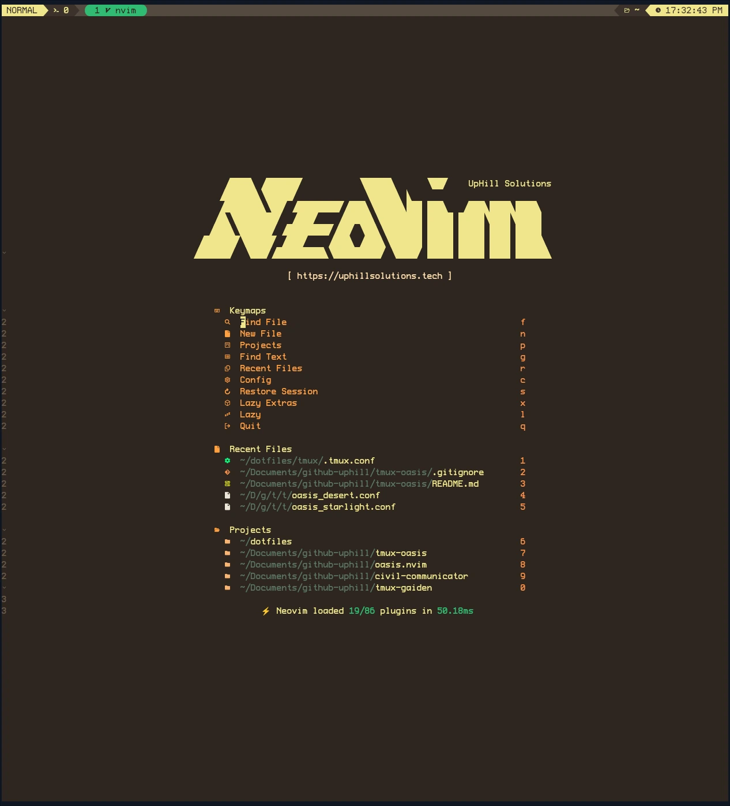
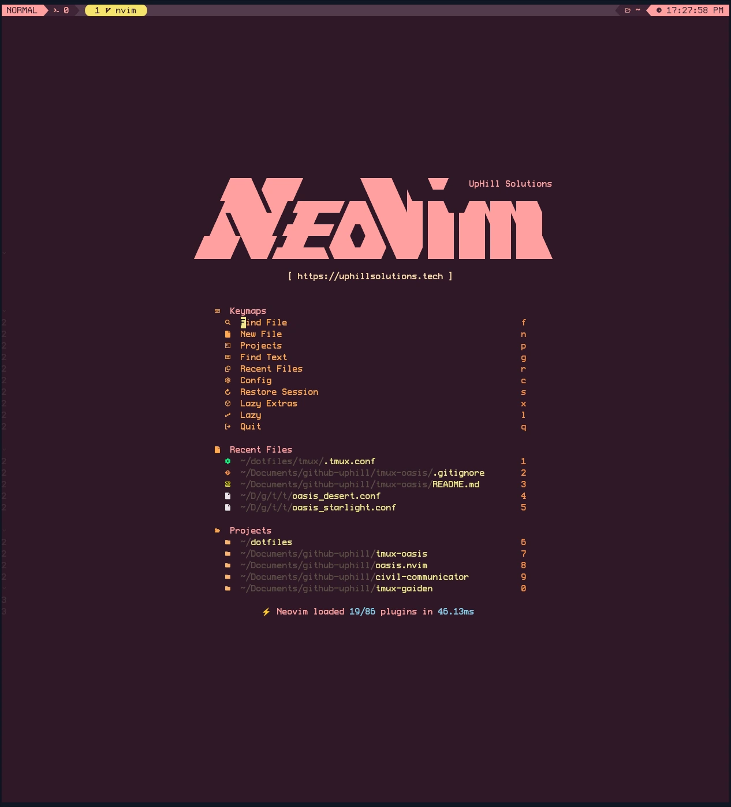
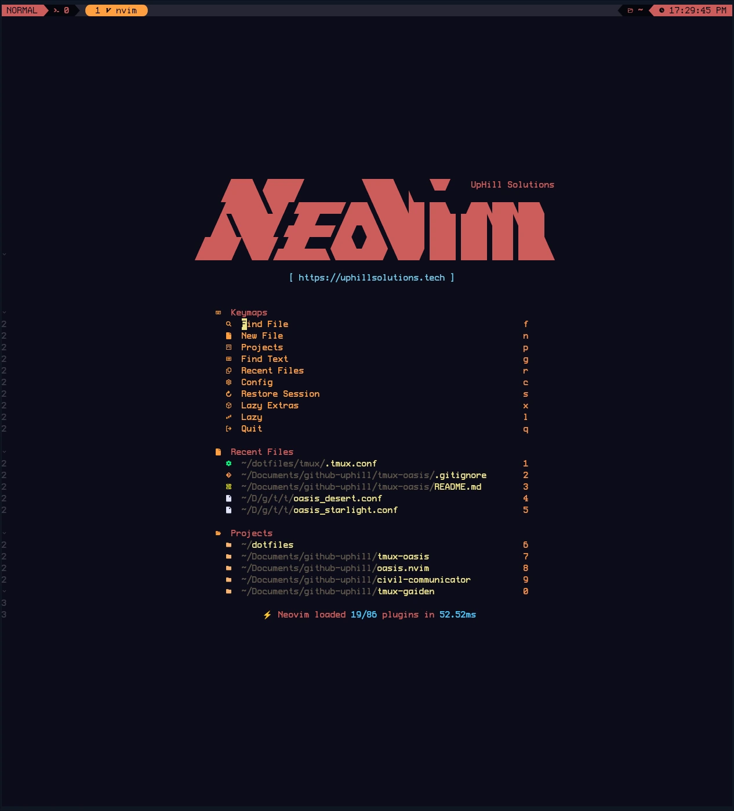
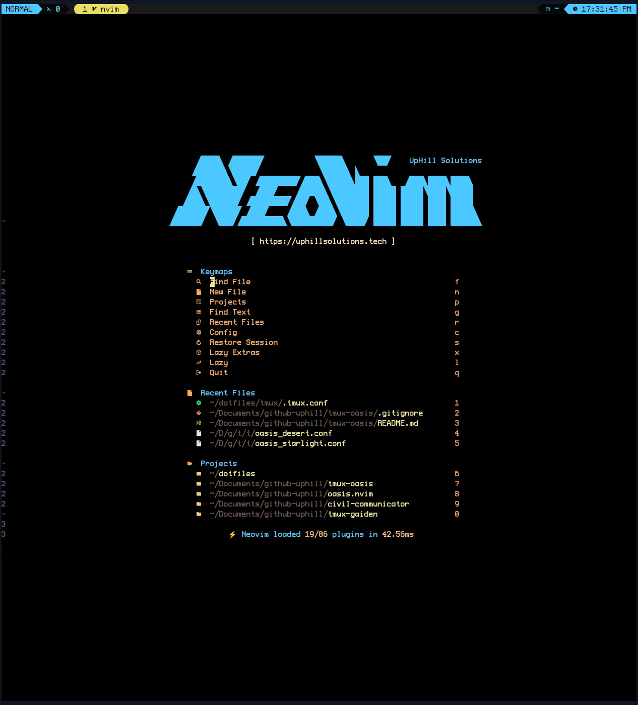

# 🏜️ Oasis Tmux

A modular dark desert-themed colorscheme for Tmux with warm, earthy tones and multiple palette variants (12 Total Themes). Originally inspired by the classic `desert` theme for vim; includes a status line inspired by vim as well.

> [!TIP]
> This is the companion to the **Oasis** theme suite from NeoVim: [oasis.nvim](https://github.com/uhs-robert/oasis.nvim)

## Features

- **12 different theme variants**: Covers the entire rainbow of options with an emphasis on being dark. Variants are all desert inspired and include (`lagoon`, `desert`, `dune`, `sol` etc.). There are 4 different black variants as well.
- **Automatic theme loading**: Set `@oasis_flavor` and the system will handles the rest
- **Advanced status line**: Dynamic mode indicators with color-coded states inspired by `vim` for each of tmux's modes: includes `NORMAL`, `COMMAND`, `COPY`, `VIEW`, `CHOOSE`, `CLOCK`, and `OPTIONS` modes.
  - [Status bar screenshots here](#status-bar-with-dynamic-modes)
- **Modular design**: Separate theme files and unique status line configurations (_you could just download **only** what you need_)
- **Standalone**: Zero dependencies on any other plugins

## Screenshots

### Classic Desert Themes

<table>
  <tr>
    <td align="center">Lagoon</td>
    <td align="center">Desert</td>
  </tr>
  <tr>
    <td></td>
    <td></td>
  </tr>
  <tr>
    <td align="center">Abyss</td>
    <td align="center">Twilight</td>
  </tr>
  <tr>
    <td></td>
    <td></td>
  </tr>
</table>

### Full Color Spectrum (12 Themes Total)

<table>
  <tr>
    <td align="center">Sol</td>
    <td align="center">Canyon</td>
  </tr>
  <tr>
    <td></td>
    <td></td>
  </tr>
  <tr>
    <td align="center">Mirage</td>
    <td align="center">Cactus</td>
  </tr>
  <tr>
    <td></td>
    <td></td>
  </tr>

</table>

> [!NOTE]
> This is just a small sample. There are many more. [Click here to see them all](#view-all-theme-variants)

### Status Bar with Dynamic Modes

<div align="center">

**Normal Mode**
<br>


**Command Mode**
<br>


**Copy Mode**
<br>


**View Mode**
<br>


**Choose Mode**
<br>


**Clock Mode**
<br>


**Options Mode**
<br>


</div>

## View All Theme Variants

<details>
  <summary><b>All variants (click to expand)</b></summary>

### Sol - Red

Hot, scorching desert sun with intense red tones


### Canyon - Orange

Rich oranges of desert canyon walls


### Dune - Yellow

Sandy beiges and warm yellow earth tones



### Cactus - Green

Fresh greens of desert vegetation


### Mirage - Teal

Cool teals of shimmering desert mirages


### Lagoon - Blue

The original Oasis theme, cool blues of the oasis lagoon


### Rose - Pink

Soft pinks of the warm desert rose



### Twilight - Purple

Evening desert with purple and indigo hues


### Desert - Grey

Inspired by the classic vim desert theme, neutral sand and earth tones


### Night - Off Black

Deep desert night sky, almost black for those who prefer softer darkness



### Abyss - Black

Deep, dark variant with mysterious depths


### Starlight - Black Vivid

Desert abyss illuminated by brilliant starlight with vivid accent colors



</details>

## Installation

### Method 1: Tmux Plugin Manager (TPM) - Recommended

1. Add to your `tmux.conf`:

```tmux
set -g @plugin 'uhs-robert/tmux-oasis'
set -g @oasis_flavor "lagoon"  # Optional: defaults to lagoon
```

2. Install with TPM: `prefix + I`

### Method 2: Manual Installation

1. Clone this repository:

```bash
git clone https://github.com/uhs-robert/tmux-oasis ~/.tmux/themes/tmux-oasis
```

2. In your `tmux.conf`, set your preferred theme variant:

```tmux
set -g @oasis_flavor "lagoon"
```

3. Source the main configuration:

```tmux
source-file "~/.tmux/themes/tmux-oasis/oasis_tmux.conf"
```

4. Reload tmux: `tmux source ~/.tmux.conf`

## Usage

### Available Theme Variants

#### By Dominant Color

- `sol` - **Red** - Hot, scorching desert sun with intense red tones
- `canyon` - **Orange** - Rich oranges of desert canyon walls
- `dune` - **Yellow** - Sandy beiges and warm yellow earth tones
- `cactus` - **Green** - Fresh greens of desert vegetation
- `mirage` - **Teal** - Cool teals of shimmering desert mirages
- `lagoon` (default) - **Blue** - The original Oasis theme, cool blues of the oasis lagoon
- `twilight` - **Purple** - Evening desert with purple and indigo hues
- `rose` - **Pink** - Soft pinks of the warm desert rose
- `desert` - **Grey** - Inspired by the classic vim desert theme, neutral sand and earth tones
- `night` - **Off Black** - Deep desert night sky, almost black for those who prefer softer darkness
- `abyss` - **Black** - Deep, dark variant with mysterious depths
- `starlight` - **Black Vivid** - Desert abyss illuminated by brilliant starlight with vivid accent colors

> [!TIP]
> Feel free to add your own variants by creating `themes/oasis_[variant].conf` files

## Status Line Features

The status line is inspired from 'lualine' in Neovim. It includes:

- **Dynamic mode indicators**: Visual indicators for `prefix mode`, `copy mode`, `command mode`, `tree mode` etc.
- **Session information**: Current session name with icons
- **Current directory**: Abbreviated path display
- **Real-time clock**: Hours, minutes, seconds with AM/PM
- **Color-coded states**: Different colors for all of the different tmux modes

## (Devs) Creating New Theme Variants

1. Create a new file in `themes/oasis_[name].conf`
2. Define all the `@thm_*` color variables
3. Use `set -g @oasis_flavor "[name]"` in your tmux.conf
